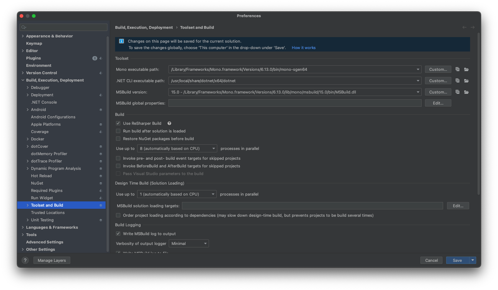

Title: Setup an M1 Mac for Xamarin tooling
Drafted: 04/07/2023
Published: 04/07/2023
Tags:
    - ARM
    - dotnet
    - macOS
    - Jet Brains
    - Rider
    - Xamarin
---

## TLDR
on M1 mac you HAVE to have an x64, but there is no arm x64 of 3.1 so you have to set the executable path manually in your IDE.

# Yeah ... why do a Xamarin post? who does that with MAUI out?

The guy who has to feed himself.

# YaY new Mac, boo old dotnet
If you are like me and needed a new mac for iOS development and the best option was an ARM based Mac, you likely didn't read the fine print.  I know there is an architecture difference between the x64 intel and the ARM 64 chips.  What I didn't understand at the time, running any mono based compilation would require some setup.  The remainder of this post will attempt to explain a few things.

- Why some versions of dotnet require setup for ARM chips
- Why you have to select the correct version of msbuild
- Why mono has anything to do with this
- Why "just upgrade" isn't an option

# x64 vs ARM

- netcore 3.1
- greater than net 5.0 is official ARM support

*Note*: Because the .NET runtime has built in hooks to look for version, it will look for an ARM64 version of the .NET 3.1 runtime.  There is no ARM version of the .NET 3.1 runtime only an x64 version.  This effectively breaks the tool chain.

# My new fast ARM, no dotnet arm support till net x.x

# Mono runtime concerns
6.12 vs 6.13

[GitHub Issue](https://github.com/mono/mono/issues/20250) for where the current release information is.  There are unreleased mono bits that are required for some of the new compiler features.  If you need those, you can find them here

6.13 is available [here](https://www.mono-project.com/download/nightly/)

# Tools, Build and Execution

This screen in Jet Brains Rider has become my most viewed page in all the Preferences!

### Environment Setup Steps

#### Prerequisites

1. Homebrew, if you are going to install homebrew do it before you start.  It has been reported that Homebrew can negatively affect the installed xcode version

1. Download current version of .NET (currently [.NET 8](https://dotnet.microsoft.com/en-us/download/dotnet/thank-you/sdk-8.0.201-macos-arm64-binaries))
2. Download [.NET 3.1 x64](https://dotnet.microsoft.com/en-us/download/dotnet/thank-you/sdk-3.1.426-macos-x64-installer) (there is no ARM version)
3. Install Xamarin.iOS 16.4.0.18 (https://github.com/xamarin/xamarin-macios/blob/main/DOWNLOADS.md)
4. Install Mono, two versions of Mono should be considered
    1. [6.12.0.206 - Current Stable](https://www.mono-project.com/download/stable/)
    2. [6.13.0.1235 - Nightly](https://download.mono-project.com/archive/nightly/macos-10-universal/)
    3. [GitHub Issue 20250](https://github.com/mono/mono/issues/20250) will determine if you need 6.12 vs 6.13 functionality
5. Install Rider
    1. Use the JetBrains Toolbox
6. Install XCode 15.2 (currently)
 1. [XCodes](https://github.com/XcodesOrg/xcodes)