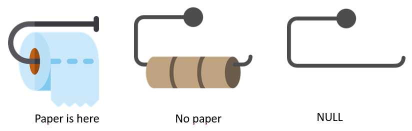

Title: Null, The Absence of a Reference in C#
Drafted: 12/04/2024
Published: 12/04/2024
Tags:
    - C#
    - Language
    - Null
    - Nullability
---

# Null, the mistake we still have not learned

[Null Reference](https://en.wikipedia.org/wiki/Null_pointer) is what Tony Hoare called his billion dollar mistake.  I always say that learning from your mistakes makes you smart, learning from others makes you wise.  So this post is going to try and impart some wisdom from what I have learned turning on the C# 8 Nullable Reference Type feature in large codebases.

#### Disclaimer

This is not a critique of the feature itself.  This is about `null`, how to take advantage of the feature, and things I think I know after doing this a few times.

# The Absence of a Reference



image borrowed from [another blog](https://blog.matesic.info/image.axd?picture=/Blog%20posts/2019/NULL/Papers1.png)

The above image demonstrates the "absensce of a reference".  There is a distinct difference between "No Paper" and "Null".  Notice that in the `null` case there is no reference or understanding there is paper at all!  It could be an image of a hand towel holder.  There is no reference to the entity we care about.  `null` doesn't just mean you have none of a given type, it means there is no actual connection to the type at all.  So when we return `null` prior to turning on Nullable Reference Types, we are technically violating the contract we have established with our consumer.

The language feature solves this by allowing developers to provide a type for the reference you expect.  Sort of a type safe `null`.  The compiler can now understand `null` in the context of `type` because every `type` has _nullabilty_; the ability to be `null`.  Declaring `Nullable<T>` (`T?`), you are communicating to the compiler you expect it to handle the _null state_ for the provided `type`.  If you attempt to assign `null` to `T`, the compiler complains because `T?` is required in order to accept `null`.

## Returning `null`

When you return `T?`, you are forcing any consumer of that return value to verify the _nullabilty_ and the _null state_ of what you provide them.  Whether it's a method or a property, every inspection will require an evaluation of the _null state_.  Before this feature, you didn't have the information available at compile time, and lack of doing an evaluation would result in a [`NullReferenceException`](https://learn.microsoft.com/en-us/dotnet/api/system.nullreferenceexception)

## `null` method parameters

When accepting `T?` as a method parameter you are taking in something that is potentially `null`.  You don't know the context of why it's null, so if your method requires the value to exist, you can check for null and throw.

Take the MAUI current application

```csharp

public class Application
{
    public Application? Current { get; }
}

...

public static true SomeExtension(this Application? application) // nullable parameter
{
    ArgumentNullException.ThrowIfNull(application, nameof(application));

    // do stuff
}

...

Application.Current.SomeExtension();  // if this is null for a reason we don't expect, an informative exception is thrown.

```

# Turning on C# Nullability

### Handle `null`

Unhandled `null` returns generally result in [`System.NullReferenceException`](https://learn.microsoft.com/en-us/dotnet/api/system.nullreferenceexception).  When defining an API surface with nullability turned on you cannot return `null` from a method or property without making the return value nullable.  Once you change the type to `T?`, you will get compilation errors (with the warnings as errors) when you are potentially creating a `NullReferenceException`.  This will allow you to handle these concerns accordingly and evaluate if this is recoverable for your application.

### Don't return `null` if you can return a default value

Given the below signature we could optimize the implementation (and solidifying the contract), by changing it.

```csharp
public IEnumerable<Thing>? Things()
{
  return apiClient.Get<Thing>();
}
```

to

```csharp
public IEnumerable<Thing> Things()
{
  var result = apiClient.Get<Thing>();

  return result ?? Enumerable.Empty<Thing>();
}
```

In this we have provided a default value for the return.  Our consumer now only needs to take the return value and start processing.  They don't have to check for the existence of a value, we've guarnteed _something_ gest returned.

### `bool?` is not the new "3 way state"

Yes, the _null state_ creats a built in 3 state `enum`.  I know it's tempting to use this in places.  Resist.  While it is fine for some use cases, it is not scalable.  The second you need a fourth value, you have a lot of code to modify.

### methods can accept null arguments and still guard against them being null

Back to our `Application.Current?` example, you don't expect it to be null, but it _can_ be null.  If you don't want it to be null when you are using it, you should guard against it.  We don't want the objects _null state_ to potentially bite us, we have to take control over it.

### nullable default method parameters are fine internal to a system, but shouldn't cross "subsystem" boundaries

This next tip is more for developers making public API's that others consume.  Given the method with the following signature.  If in the future I decide to change `bool? shouldCare = null` to `bool? shouldCare`, by the rules of semver, this is a breaking API change.  It's not the end of the world, but I have made this mistake and burned a major version for no reason!

```csharp
public interface IDoStuff
{
  public Task MakeStuffHappen(string name, int quantity, bool? shouldCare = null);
}
```

### Use the `MaybeNull` and like attributes

[`System.Diagnostics.CodeAnalysis`](https://learn.microsoft.com/en-us/dotnet/api/system.diagnostics.codeanalysis) has attributes you can use to decorate your API surface.  They are supported by the compiler.  If you 

### Encapsulate your nullability, don't force every consumer to check for null if you can guard against it for them

### Don't act like it's not there.  This "see no evil" approach causes defects

- C# 8 feature
  - Turning on the feature will help you appreciate how the absence of a thing™ can severly hurt your software

### Only Return Null When

- Doing so won't kill your application ... yes ... I have seen devs do this
- The application can recover from the null value being passed
- You expect ever consumer of the method to gracefully handle a `null` return value

### The `default` value of a reference object is `null`

### `OrDefault()` methods return `null`

# Tips for handling `null` in your code

### File or Assembly at a time

### Start with the edges of the application either the data layer or the UI layer

### Small commits so you can easily walk backwards

- ReactiveUI
- Prism

### Turn on C# nullability warnings as errors

### Don't use Null Reference Exceptions as your catch all unhandled exception, it's not exceptional, you control it

### Don't use nullable enums, rather default the enum with a `None` or `NA` or even `Default`

### `!` operator seems like a good idea, but it defeats the purpose of the effort, use it sparringly

### Pay attention to methods that return null but could benefit from returning a `default`

- `IEnumerable<T>?` => `[]`

### for Dtos use `init` if you prefer object initialization syntax

## Links

- [Nullable References Documentation](https://learn.microsoft.com/en-us/dotnet/csharp/nullable-references)
- [Nullable migration strategies](https://learn.microsoft.com/en-us/dotnet/csharp/nullable-migration-strategies?source=recommendations)
