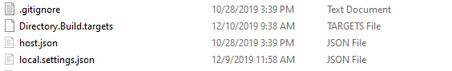

Title: How to call an HTTP Trigger from a Queue Trigger
Drafted: 12/09/2019
Published: 12/09/2019
Tags:
    - Azure DevOps
    - Azure Functions
    - Azure Pipelines
    - Serverless
---

## Initial Project
I want an Azure Queue Trigger to call downstream Azure Http Triggers.

#### Queue Trigger
```csharp
  public class ImportQueueFunction
    {
        private readonly HttpClient _client;

        public ImportQueueFunction(IHttpClientFactory httpClientFactory)
        {
            _client = httpClientFactory.CreateClient("functions");
        }

        [FunctionName(nameof(QueueFunction))]
        public void QueueFunction(
            [ServiceBusTrigger("queue", Connection = "Endpoint")]string queueMessage,
            ILogger log)
        {
            try
            {
                log.LogInformation($"C# ServiceBus queue trigger function processed message: {queueMessage}");

                ImportMessage message = JsonConvert.DeserializeObject<ImportMessage>(queueMessage);

                var url = _client.BaseAddress + $"api/{message.FunctionType}";

                _client.PostAsync(new Uri(url), new StringContent(queueMessage));
            }
            catch (Exception ex)
            {
                log.LogError(ex, ex.Message);
            }
        }
    }
```
#### Http Trigger

## Adding DI Container
### Adding Serilog
### Adding Application Insights

## Local
## Azure Pipelines
```
##[error]C:\WINDOWS\ServiceProfiles\NetworkService\.nuget\packages\microsoft.azure.webjobs.script.extensionsmetadatagenerator\1.1.2\build\Microsoft.Azure.WebJobs.Script.ExtensionsMetadataGenerator.targets(33,5): error : Metadata generation failed. Exit code: '-532462766' Error: 'Error generating extension metadata: System.IO.DirectoryNotFoundException: The path `C:\agent\_work\9\s\src\StarTrax.Import\bin\Release\netcoreapp2.1\binbin` does not exist. Unable to generate Azure Functions extensions metadata file.   at ExtensionsMetadataGenerator.ExtensionsMetadataGenerator.Generate(String sourcePath, String outputPath, ConsoleLogger logger) in C:\azure-webjobs-sdk-script\tools\ExtensionsMetadataGenerator\src\ExtensionsMetadataGenerator.Console\ExtensionsMetadataGenerator.cs:line 23   at ExtensionsMetadataGenerator.Console.Program.Main(String[] args) in C:\azure-webjobs-sdk-script\tools\ExtensionsMetadataGenerator\src\ExtensionsMetadataGenerator.Console\Program.cs:line 32Unhandled Exception: System.IO.DirectoryNotFoundException: The path `C:\agent\_work\9\s\src\StarTrax.Import\bin\Release\netcoreapp2.1\binbin` does not exist. Unable to generate Azure Functions extensions metadata file.   at ExtensionsMetadataGenerator.ExtensionsMetadataGenerator.Generate(String sourcePath, String outputPath, ConsoleLogger logger) in C:\azure-webjobs-sdk-script\tools\ExtensionsMetadataGenerator\src\ExtensionsMetadataGenerator.Console\ExtensionsMetadataGenerator.cs:line 23   at ExtensionsMetadataGenerator.Console.Program.Main(String[] args) in C:\azure-webjobs-sdk-script\tools\ExtensionsMetadataGenerator\src\ExtensionsMetadataGenerator.Console\Program.cs:line 32' [C:\agent\_work\9\s\src\StarTrax.Import\StarTrax.Import.csproj]
##[error]Process 'dotnet.exe' exited with code 1.
```

https://github.com/Azure/azure-functions-host/issues/4055

In the folder where your Azure Function .csproj file lives there is a `Directory.Build.targets` file.  This seems to only exist for azure functions that are upgraded.  If you do File => New Project and start a new one (from vs v16.3.8 at least), this file doesn't seem to exist.



There is the following `PropertyGroup` node is in that file

```
    <PropertyGroup>
        <_IsFunctionsSdkBuild Condition="$(_FunctionsTaskFramework) != ''">true</_IsFunctionsSdkBuild>
        <_FunctionsExtensionsDir>$(TargetDir)</_FunctionsExtensionsDir>
        <_FunctionsExtensionsDir Condition="$(_IsFunctionsSdkBuild) == 'true'">$(_FunctionsExtensionsDir)bin</_FunctionsExtensionsDir>
    </PropertyGroup>
```

remove the extra `bin` at the end of the `_FunctionsExtensionsDir` and all should be good.

https://github.com/Azure/azure-functions-host/issues/4578#issuecomment-564103277
## Azure Portal
