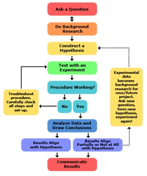
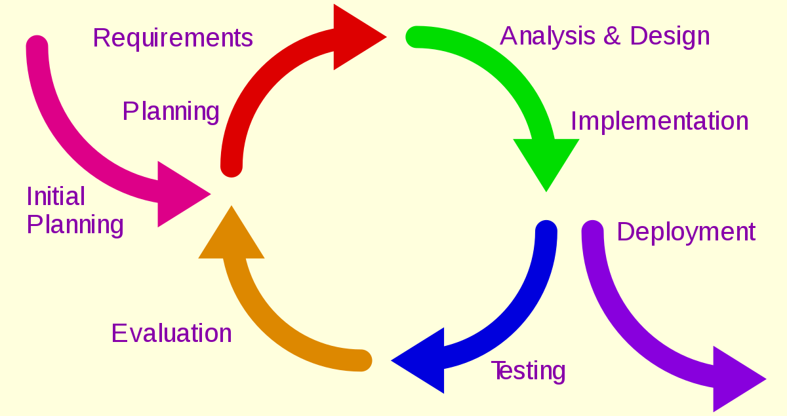

Title: Scientific, Iterative, Test Driven oh my!
Drafted: 01/25/2018
Published: 08/14/2019
Tags:
    - Scientific Method
    - Test Driven Development
---

# Hypothesis

I know I may be old fashioned, but I wanted to be a Computer Scientist.  As a kid the science of computing excited me!  Entering college, the Computer Science track seemed natural.  I would learn the joys of Data Structures and Algorithms analysis, and the woes that is the Theory of Computation.
Your job as a scientist is to disprove theory.  Your enemy is theory and the tool you use to vanquish said enemy is, application.  So when I write software, I do not abandon the corner stone of our claim to existence, the Scientific Method.

Application development has become more art, and less science.  Designers talk about feeling and user emotion.  Product Owners articulate requirements for features.  Project Managers juggle resources and time (because scope rarely decreases) to fit in work, and release dates.  Developers work to line up buttons on pages.  But where has all the science gone?  While at the 2019 [Xamarin Developer Summit](https://twitter.com/xamdevsummit), I had a conversation with [Claudio Sanchez](https://twitter.com/ClaudioASanchez) on the Scientific Method.

## The Method

Do you remember the Scientific Method?!  I stumbled on this picture one day after a very spirited conversation with a QA team.  I was attempting to explain the realities of the software delivery process.  How an idea goes from inception to completion.  That we should iterate through a concept until it is ready to be consumed.  The below diagram is what I used to try and ariculate my thoughts to the team.

This is how I relayed my thoughts to that team:

- **Gather Requirements**: This involves asking questions and doing research so we can pose an educated guess.
- **Prototype**: Hypothesis, or proof that your approach to solving a problem has validity.
- **Implementation**: Testing the hypothesis.  Will my prototype evolve into working production ready code?
- **Testing**: Where data is captured.  You determine if the feature meets the requirements.  There will be assumptions made, conclusions drawn, and outcomes documented.
- **Release**: You've done the thing, it's good enough for real people to use.  You communicate to your users there is a new release.  Go back and ask more questions!

# Experiment

QA had a valid working build.  QA had been provided the test cases approved by the product deliver team. QA proceeded to ask me hypotheical questions and imagined scenarios, to which I constantly replied "document the scenario, test it, and report your findings".  I did not find this to be unreasonable.  Your job function as a tester is to, I don't know, test a hypothesis?  You have the scenario that needs to be tested (the hypothesis), and the application (the experiment), so you should be able to verify any condition (test case) against it.

So can you see my frustration when you ask me "What should the application do, when I do X?", and I reply "I can tell you what it's supposed to do, or you can tell me what it does and we can discuss what it *should* do."  At this point I was sure I was the crazy person, because I would not abaondon the method.  I had done my part.  I had taken the hypothesis and created an experiment that could be proven or disproven. Yet I was still presented with theory?

QA was more concerned with a theoritical argument telling me they didn't *feel* it would satisfy the requirement, rather than just applying the test to the theory.  It was more important that QA open bugs to point out I had missed edge cases, and point out how bad a developer I am, than it was to identify the edge cases **we as the product delivery team has missed** and report any acceptable resolutions.

## Iterate

What I attempted to explain next was a simple cipher know as the [Iterative Method](https://en.wikipedia.org/wiki/Iterative_and_incremental_development)

We forget sometimes that software is software for a reason.  Soft === [Pliable](https://www.merriam-webster.com/dictionary/pliable).  Software should not have rigid design, or hard requirements.  Software should be fluid, and grow/shrink based on the clients needs.  It isn't some stone structure that once we cut the slab, we can't do anything to change it.  So why do we think of software as done?  When is software done?  When there are no more requirements to implement and the system is defect free?

This model points out a similar concept as the Scientific Method.  We have to be willing to throw out an experiment when it does not satisfy our tests.  We should document the result of the test so we can form a better hypothesis and eventually disprove a theory.  We should be comfortable going back evaluating and finding the right solution for the problem.  Response to feedback is the critical piece of this puzzle.

## TDD

I went on further to talk to the development team around this same concept (I was on a roll!).  "Hey guys, doesn't this Scientific Method look similar to Test Driven Development?"

Isn't one of the goals of test driven development to have a set of repeatable, automated tests?  Does this not fall in line with making sure our Theory stays sound after repeated tests of the Hypothesis?  Does this not seem like a microcosm of creating a sound theory?  Software is built one line of code at a time, shouldn't we strive to automate the test of the experiment so we can continue to pass the results everytime the experiement is testing?

- **Select Task** is similar to drafting a hypothesis
- **Write Test** is similar to drafting an experiment
- **Run Test** lets you know if your experiment was valid or invalid
- **Expected Result** ask yourself, is this the right redesign patter?  Is the code I am writing giving me the behavior I expect?  Obtain feedback from the code.

# Theory

Reacting to your feedback is a critical stage in the software deliver process.  When QA comes back having tested it and tells me. "It does X, we expected Y" now we have grounds for a change.  Now we can discuss, was the hypothesis flawed?  Was the experiement wrong?  Was the test administered accurately?
You should not ignore the result of your testing and evaluation.  You should use it to create the most sound theory you can.  Remember how Science works?  A theory is only considered to be true until somebody can disprove it.  So we should seek to make our applications so robust that nobody else can make one better, there by disproving our theory.
