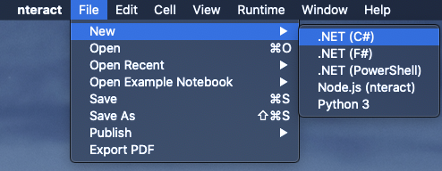

Title: Setting up nteractive on macOS for ZSH
Drafted: 02/08/2020
Published: 02/14/2020
Tags:
    - C#
    - Jupyter
    - LinqPad
    - nteractive
    - ZSH
---

# The only problem with C# on Mac ...
Friday night I was hanging out with Michael Stonis, Ryan Davis and others on Michael's live stream.  He was working through a problem in a Unit Test, which I am sure we all have done.  He comments saying, "All of this won't make the unit test".  Me being a comedian in my own head started goading him. "Looks like LinqPad work to me."  I said this knowing there is no LinqPad on macOS and I clearly see he is using a Mac.  Two days prior I had a conversation with another friend about the only thing I miss from Windows development is LINQPad!

Michael posted [Interactive C#](https://devblogs.microsoft.com/dotnet/net-interactive-is-here-net-notebooks-preview-2/) which I hadn't seen, but am now itching to try at 8:00pm on a Friday night!

# The setup
So this is were things got weird for me.  I am a huge fan of documentation.  When a project is well documented, it makes it much easier for a new person approaching it to consume.
The [nteractive documentation](https://nteract.io/kernels/dotnet) made the setup seems straight forward enough.  So I jumped right in. As these things go, one link led to another, and I eventually ended up on the [dotnet interactive README](https://github.com/dotnet/interactive/blob/master/README.md)

I installed [Anaconda](https://www.anaconda.com/distribution) and loaded a shell.  I use [ZSH](http://www.zsh.org/) these days because the experience feels better to me than the Bash shell.  No sooner do I think this might be a easy setup, with no hassle, BOOM!
 
# Error
Oh no.  I am thwarted!  I have wasted an entire twenty precious minutes trying to set this up!  I experienced the follwing [issue](https://github.com/dotnet/try/issues/644#issuecomment-553896811) loading the jupyter notebooks.


The answer that was posted to the issue seemed reasonable, except for one small thing.  The first yellow highlight says "Open Anaconda Promopt".  Well I just downloaded and installed Anaconda and had no knowledege of it's existence before I tried to setup these notebooks.  Am I supposed to know how to open an Anaconda prompt?!  Several minutes of furious google fu later, I found on macOS it really just is your terminal.  Remember I use ZSH and not that bash thing and am now receiving another error.

```bash
$ /Users/xxx/.anaconda/navigator/a.tool ; exit;
/Users/xxx/.anaconda/navigator/a.tool: line 1: syntax error near unexpected token '('
/Users/xxx/.anaconda/navigator/a.tool: line 1: 'bash --init-file <(echo "source activate /Users/xxx/anaconda/anaconda;")'

[Process completed]
```

I was getting close.  I could smell the victory over my setup troubles! I found github issue [ContinuumIO/anaconda-issues/issues/1831](https://github.com/ContinuumIO/anaconda-issues/issues/1831#issue-232806289) that sounded like my problem.  This was specific to Anaconda not working on ZSH.  Reading further down the comments.  I found my [answer](https://github.com/ContinuumIO/anaconda-issues/issues/1831#issuecomment-569094667)

```bash
conda init zsh
...

dotnet interactive jupyter install
```

Now everything worked flawless just like the original docs said:



Now I have nteractive notebooks working on my local machine and I can't wait to compare it to LinqPad!!!