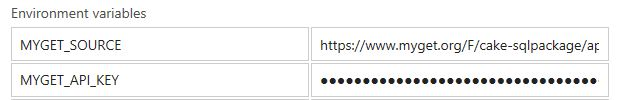

Title: Building with Cake.Recipe
Published: 09/07/2017
Tags:
 - Cake
---

# A build recipe
---
For those who are new to Cake, I consider Cake a build automation and orchestration platform.  It allows me to script my build in C#, build an application local the same as on my CI server, and port it to another CI system with ease.  To most people, these are not issues.  They setup CI and only look at it when the build breaks.  I look at a build process the same as I do my code, adapting to deliver value to my users.

[Cake.Recipe](https://github.com/cake-contrib/Cake.Recipe) is a configurable build pipeline that can conduct my build process.  Current features range from code inspection to notifying twitter of your new version.  Cake.Recipe is easy to setup.  I can define my build process by providing a few componenets, build parameters and some configuration.

# recipe ingredients
---
Things we'll need:

1. The Cake [bootstrapper](http://cakebuild.net/docs/tutorials/setting-up-a-new-project) script
2. A cake file to add Cake.Recipe and provide our build parameters
3. `./nuspec/nuget` folder in the root directory
4. Environment variables to provide keys

Your recipe.cake file could look something like the one below, but there are many good examples in the [cake-contrib](https://github.com/cake-contrib) repositories.

Creating a nuget package is convention based.  You will need a `./nuspec/nuget` folder in the root directory and a .nuspec file in that folder.  The script will look for a .nuspec file in this directory and use it to package the project.  It will also, output the resulting package in a BuildArtifacts folder.

The [documentation](https://cake-contrib.github.io/Cake.Recipe/docs/usage/creating-packages#how-it-works) states:

> The Publish-MyGet-Packages task has two criteria, that you want to publish a MyGet package and that packages have actually been created. This task also contains the check for the environment variables we set above and will record that error and continue to execute the next task.

Going into my AppVeyor settings I add the following environment variables:

Finally adding the below build script parameters in AppVeyor will publish the package to MyGet:

`.\build.ps1 -Target AppVeyor`

# A recipe for you
With Cake.Recipe as a template you can write a build process once and reuse it to deliver a consistent experience across multiple projects.  Imagine a Web Api recipe that will build, deploy and integration test all your Web Api projects.  You can centralize your build logic and allow each project to use only the components it requires.  Cake.Recipe is a recipe for a successful and reusable build process for multiple projects with similiar automation needs.