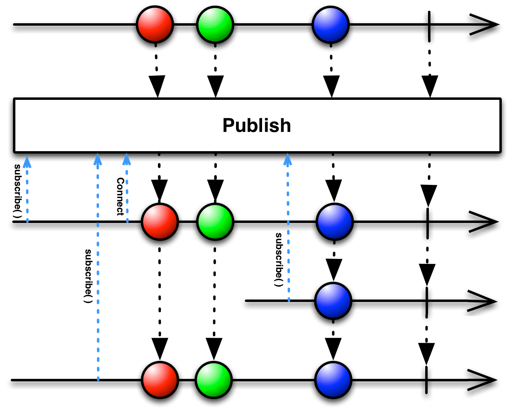
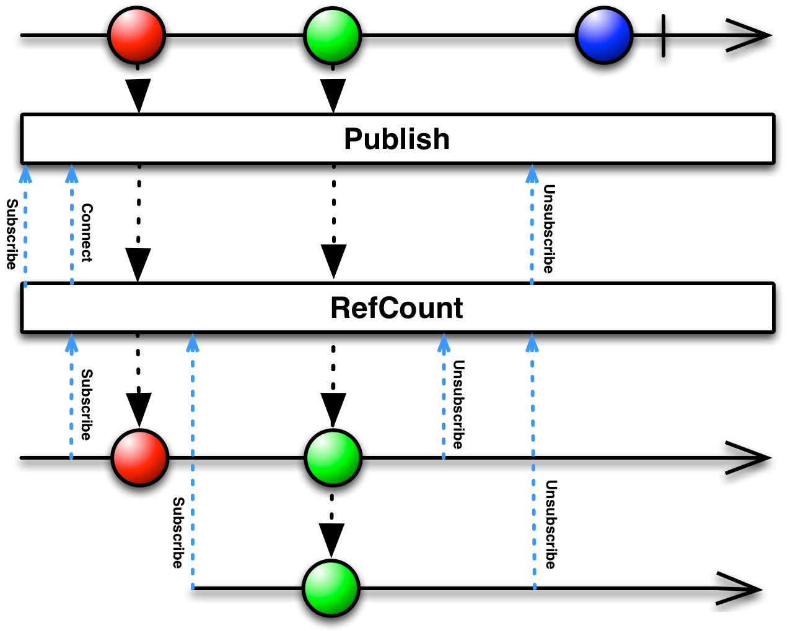

Title: Publishing Reference Counts for Connected Observables
Drafted: 10/18/2019
Published: 11/15/2019
Tags:
    - Reactive Extensions
    - ReactiveUI
---

## To the mountain top
While looking into [GH-2170](https://github.com/reactiveui/ReactiveUI/issues/2170) I wound up digging through [RefCount](https://github.com/dotnet/reactive/blob/master/Rx.NET/Source/src/System.Reactive/Linq/Observable/RefCount.cs) on the dotnet reactive repository. So, when I get into the guts of code that is over my head, I talk to the guru's.  I got schooled by a Functional Reactive Programming sorceress about two specific Reactive Operators `Publish()` and `RefCount()`.  I am come down from the mountain top with knowledge for the people!

### Publish

If your not familiar with the [Publish Operator](http://reactivex.io/documentation/operators/publish.html) it basically takes a source observable and changes it to an [IConnectableObservable](https://docs.microsoft.com/en-us/previous-versions/dotnet/reactive-extensions/hh211887(v%3Dvs.103)#methods).



> A connectable observable resembles an ordinary Observable, except that it does not begin emitting items when it is subscribed to, but only when the Connect operator is applied to it. In this way you can wait for all intended observers to subscribe to the Observable before the Observable begins emitting items. 

Take the following example:

```csharp
makeNetworkCall.Where(...);    // Does nothing
makeNetworkCall.Where(...).Subscribe();   // One Network Call!
makeNetworkCall.Where(...).Subscribe();   // Another Network Call!
```

This will make a network call for every subscription, then clean it up when they dispose.  This is fine if that is your explicit desire, but are you sure you _want_ to make a network call for each subscription?

If not you might write the following allowing everyone to subscribe to the subject, and they all get the same result:

```csharp
var subject = new Subject();

makeNetworkCall.Subscribe(subject);

return subject;
```

Now everyone subscribes to the `subject`, and they all get the same result.  This isolates the subscription causing a call to the network.  This is what `Publish()` does, but not quite.  If you notice the above connects and then immediately disposes.
`Publish()` allows you to call `Subscribe()` regularly in your code, then `Connect()` and make everything go live all at once.  This is a form of defered execution, and the basis of Hot vs Cold observables (which is beyond the scope of this post).
Calling `Connect()` connects the subject to the source.

Sometimes we don't care that we leaked, which is why RxUI's internal code has PermaRef which basically does exactly this

### RefCount

So at this point we've moved the problem further down the road - who disposes the Connect's Disposable? Enter `RefCount()`!



`RefCount()` effectively keeps a count of the number of connections to the reference observable.

You could imagine doing this really easily with Observable.Create

```csharp
int count = 0;

Observable.Create((subject) =>
{
  count++;
  return Disposable.Create(() => count--);
});
```

RefCount automates the Connect and Disconnect logic to a ConnectableObservable.  RefCount waits for someone to subscribe to the observable, before it connects.  Once connected it keeps track of the number of observers and holds a (wait for it), Reference Count of observers.  It will stay connected to the ConnectableObservable until there are no more observers.  As long as the observer count greater than zero it is connected and returning values. We only have to Connect once, that's the whole point of `Publish()`.

So effectively here's how it all works:

```csharp
var published = makeNetworkCall.Publish().RefCount();

var d1 = published.Subscribe(); // Makes network call!
var d2 = published.Subscribe(); // No network call!

d1.Dispose();   // Nothing happens
d2.Dispose();   // Network call canceled? Whatever happens to the source when you dispose it

published.Subscribe();   // ***New*** network call! We went from 0 => 1 and reconnected
```

This is a brief example of how you can use `Publish()` and `RefCount()` to delay subscription and reduce friction of executing observable pipelines.  The next time I run into issues, I will ask the guru to teach me more, so we can learn how to observe like Rx Wizards!